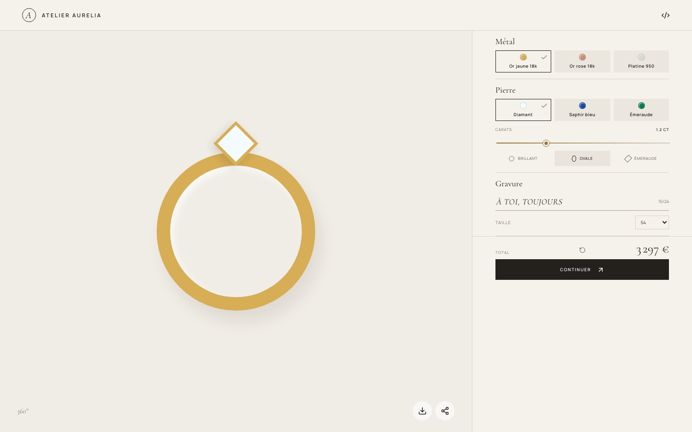
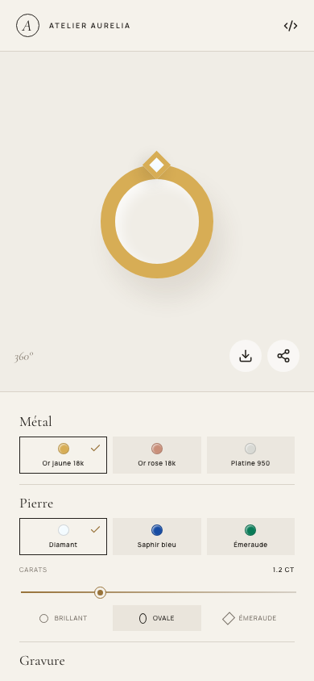

# Atelier Aurelia

A responsive, browser-based 3D ring configurator built as a product-focused
frontend case study. It combines a polished jewellery retail experience with
procedural Three.js geometry, typed configuration logic, persistence, sharing,
and automated quality checks.

**[Open the live demo](https://atelier-aurelia-ring.vercel.app)**

The customer-facing experience is intentionally in French; project
documentation and source-level explanations are in English.



<details>
<summary>Mobile view</summary>



</details>

## Product overview

Atelier Aurelia explores the technical problems behind a made-to-order product
configurator: keeping a real-time 3D scene responsive, translating product
choices into valid geometry, and preserving a configuration without a backend.
The result is a focused single-page experience rather than a complete commerce
application.

### Features

- Procedural, interactive 3D ring rendered without bundled model files
- Yellow gold, rose gold, and platinum material options
- Diamond, sapphire, and emerald stones in round, oval, and emerald cuts
- Carat and French ring-size controls that update the geometry
- Setting and pavé layout derived from stone dimensions, with collision checks
- Live indicative pricing and optional engraving (up to 24 characters)
- Automatic `localStorage` persistence and reset controls
- Shareable configurations encoded in the URL
- Client-side PNG export of the current WebGL canvas
- Responsive controls, native keyboard interactions, status announcements, and
  a simplified fallback when WebGL is unavailable

The prices and rendered materials are illustrative. The continue action is a
prototype interaction and does not create a reservation or order.

## Architecture

```text
App.tsx
├── owns configuration and browser integrations
├── renders the responsive product controls
└── lazy-loads RingScene.tsx
    ├── builds the ring from Three.js primitives
    ├── applies physical materials and studio lighting
    └── consumes jewelryLayout.ts
        └── calculates dimensions, setting clearance, and pavé placement

config.ts
├── defines the typed product catalogue
├── calculates indicative prices
└── validates and serializes shareable configurations
```

React owns the interface and state, while React Three Fiber provides the
declarative bridge to Three.js. The 3D scene is split into a lazy chunk so the
interface shell can load independently. Product state remains serializable,
which keeps persistence and URL sharing independent from rendering.

The geometry is original and generated at runtime. The jewellery references and
licensing decisions behind it are documented in
[CAD_SOURCES.md](./CAD_SOURCES.md).

## Technology

- React 19 and TypeScript
- Vite
- Three.js, React Three Fiber, and Drei
- Lucide React
- Vitest
- Oxlint
- GitHub Actions and Dependabot
- Vercel

## Local setup

Requirements: Node.js 20.19 or newer and npm.

```bash
git clone https://github.com/alkhastvatsaev/atelier-aurelia-ring.git
cd atelier-aurelia-ring
npm ci
npm run dev
```

Open `http://localhost:5173`. The application has no environment variables,
external API keys, database, or backend service.

## Quality checks

```bash
npm run lint       # static analysis
npm run typecheck  # TypeScript project checks
npm run test       # deterministic geometry and configuration tests
npm run build      # production bundle
npm run check      # all checks above
```

CI runs linting, type checking, tests, and a production build for pull requests
and pushes to `main`. Dependabot proposes monthly npm and GitHub Actions
updates.

## Engineering considerations

### Accessibility

The configuration controls use native buttons, inputs, labels, pressed states,
and a live status region. A non-WebGL representation is available when canvas
rendering is unsupported. The visual 3D interaction is still inherently
limited for screen-reader users, and the project has not yet completed a formal
WCAG audit or assistive-technology test matrix.

### Performance

The scene is lazy-loaded, device pixel ratio is capped, and geometry calculations
are memoized. `preserveDrawingBuffer` is enabled to support PNG export and has a
GPU-memory cost. Bundle budgets, real-user monitoring, and low-end device
profiling are not yet in place.

### Security and privacy

All processing happens in the browser. Configuration data is stored locally or
placed in a share URL; no personal data is submitted to a server. Shared and
stored configuration values are treated as untrusted data and validated before
use. This prototype has no authentication, payments, inventory, server-side
pricing, or order workflow.

## Roadmap

- Add component-level interaction and accessibility tests
- Replace indicative pricing with a typed server API and currency support
- Add screenshot regression tests for key materials and cuts
- Measure Core Web Vitals and define bundle/performance budgets
- Add reduced-motion controls and complete a WCAG audit
- Introduce a production checkout only alongside authentication, inventory,
  server-side validation, and payment-provider controls

## Licence

Released under the [MIT License](./LICENSE).
